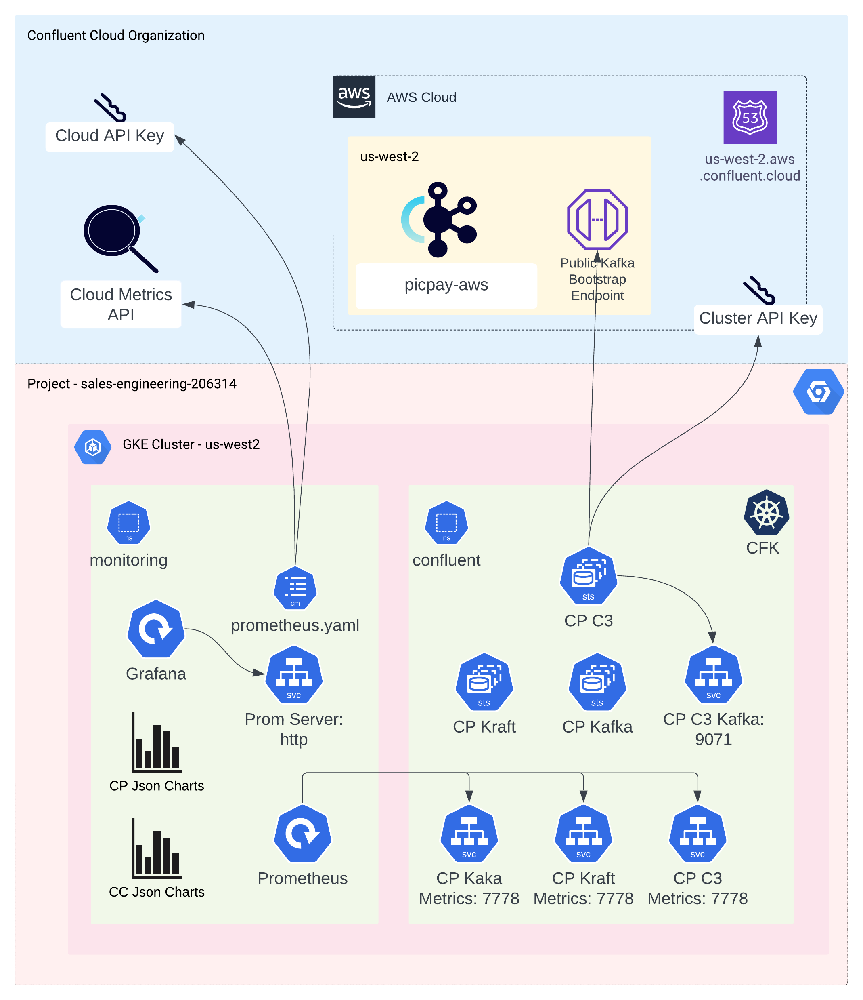

# CC-CP-Centralized-Monitoring

### This project is an example of monitoring both confluent cloud and confluent platform using a single grafana dashboad. Here, we are also using single CP Control center to manage both kafka clusters. 

## Architecture 



## Setup
```console
#! /bin/bash

export TF_VAR_confluent_api_key=<CC_CLOUD_APIKEY>
export TF_VAR_confluent_api_secret=<CC_CLOUD_SECRETKEY>
export TF_VAR_confluent_env=<CC_ENVIRONMENT_NAME> 
export TF_VAR_confluent_aws_region=<CC_AWS_REGION>
export TF_VAR_gcp_project_id=<CP_GCP_PROJECT_ID> 
export TF_VAR_gcp_region=<CP_GCP_PROJECT>
export TF_VAR_gcp_network_name=<CP_GCP_VPC> 

terraform apply 
```

## Prometheus Modification
```console
# Prometheus.yaml in k8s secrets to use CC Metrics API
```

## Teardown
```console
terraform destroy
```